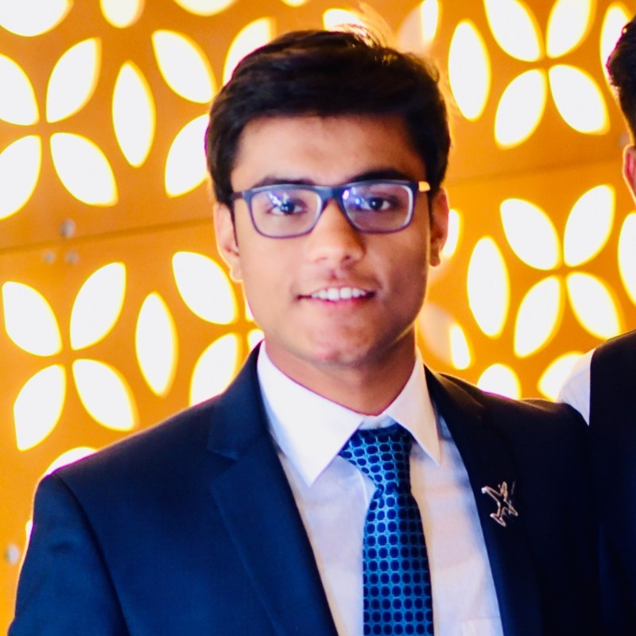

# Tejasvin Mukesh
## Computer Science Major
### UC San Diego
#### Jacobs School of Engineering

[Contact Me](#Contact)  
  
Link to my LinkedIn Profile - [LinkedIn](https://www.linkedin.com/in/tejasvin28/).

## ____________________________________

## *Biography*

I am a Computer ~~Engineering~~ Science Major at **UC San Diego**. I am passionate about Software Engineering and I am actively looking for internships for ***Summer 2021***.  
Similar to most of the computer Scientists, the first lines of code I wrote were:
```
public class Hello World
{
    public static void main(String args[])
    {
        System.out.println("Hello World!);
    }
}
```
Ever since, I have promised myself to never stop learning and continue to explore the world of Computer Science.  

I have taken the follwing coursework:  
- Introduction to OOP and Java
- Introduction to Data Structures
- Programming in C and Systems programming
- Advanced Data structures
- Software Engineering (WIP)
- Algorithms (WIP).

<p>&nbsp;</p> 

I have worked on the follwing projects:
1. Data compression using Huffman Coding
2. Implementation of Graphs in C.
<p>&nbsp;</p> 

### *Personal Background*
I come from a small town in India called Lucknow. Lucknow is famous for its culture of giving immense respect to fellow human beings. In the words of a famous historian from Lucknow:      
> Muskaraiye Aap Lucknow mei hai.

These lines translate to 'smile because you are in Lucknow'. I strive to be someone who reflects this and I hope that I bring a smile to everyone to meets me.
<p>&nbsp;</p> 

### *Career Goals*
- [x] Graduating high school
- [x] clearing the SATs
- [x] Getting admitted to a good university
- [x] Declaring Computer Science as major
- [ ] Interning in Sophomore summer
- [ ] Interning in Junior year
- [ ] Getting a Software Engineering job
- [ ] Establishing my own business
<p>&nbsp;</p> 


### *Contact*
Email: tmukesh@ucsd.edu  
Phone: +1 (702) 682 5877


